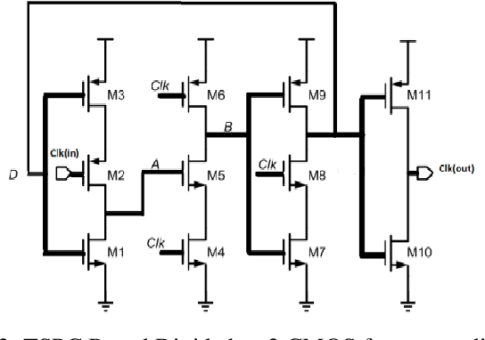

# Specification Analysis & Guideline

First of all, we choose **TSPC** over **Standard Static CMOS** methodology for this application to meet the desired specs.

---     

## Table Of Contents (TOC)

- [TSPC vs Static CMOS](#tspc-vs-static-cmos)
    - [TSPC Pros](#tspc-pros)
    - [TSPC Cons](#tspc-cons)
    - [Standard Static CMOS Pros](#standard-static-cmos-cons)
    - [Standard Static CMOS Cons](#standard-static-cmos-cons)
- [Primary Design: Divide By 2](#primary-design-divide-by-2)
- [DFF Structure](#dff-structure)

---         

## TSPC vs Static CMOS

### TSPC Pros

- Best choice for high speed applications
    - TSPC DFF is designed from ~ 11 transistors only
    - Lower parasitic capacitance (faster switching)
- Lower power consumption for the desired speed with respect to static CMOS power consumption
- Single phase clk: no need for clk inversion (prevent skew issues)

### TSPC Cons

- Sensitivity to Sizing: transistor width ration (W/L) are critical functionality and full voltage swing
- The design is more complex with respect to static CMOS

### Standard Static CMOS Pros

- High robustness and that's more reliable for Combinational Logic
- Low static power

### Standard Static CMOS Cons

- High transistor count for a single DFF ~ 24 transistor
- Lower speed due to all of these transistors
- Higher power consumption at the desired speed
- Needs clk inversion which may result in skew issues

---     

## Primary Design: Divide By 2

- Simply, the design requires a single **DFF**.           
- Process ->
    - Clocks the DFF with the input clk signal (to be divided)
    - Negative Feedback: Refeed the DFF with Q_bar
- Analysis ->
    - At each clk edge from the input clk signal, the output toggles
    - Through a complete clk period from the input clk signal, the out is fixed
    - Every 2 periods of the input clk signal == Single clk period of the output clk signal

---         

## DFF Structure

